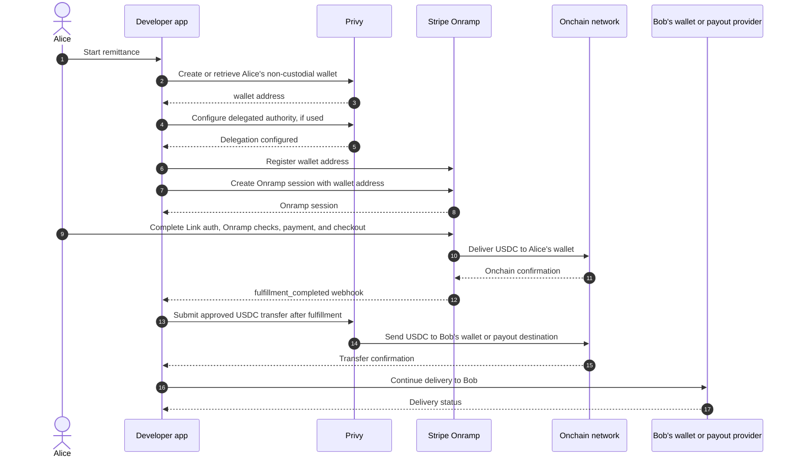

# Stablecoin Remittance Recipe

This recipe is for developers building cross-border money movement on stablecoin rails while keeping control over their app experience, wallet layer, and downstream payout partners.

It combines:

- Privy for user-owned, non-custodial wallets and delegated wallet actions.
- Stripe Embedded Components Onramp for converting a sender's fiat payment into USDC and delivering it to the sender's wallet.

The important boundary is simple: Stripe Onramp delivers USDC to the sender's wallet address provided for the session. After USDC reaches that user-owned wallet, the developer controls wallet orchestration, transfer timing, payout/offramp routing, local-currency delivery, returns, retries, and customer support.

## When To Use This Recipe

This recipe is a good fit for developers that:

- Want a modular remittance stack rather than a single end-to-end payout product.
- Want to own the sender and receiver experience.
- Want to bring their own wallet, offramp, or last-mile payout providers.
- Want to let users hold stablecoin balances instead of immediately off-ramping every transfer.
- Want to build beyond remittance into wallet or balance experiences, such as stablecoin balances, yield, card spend, or other products supported by their product setup.
- Are prepared to handle downstream support, returns, and customer communication after USDC reaches the sender's wallet.

## Example: Alice Sends To Bob

Alice is in the US and wants to send value to Bob in Mexico through a developer app.

1. Alice starts a remittance to Bob.
2. The developer creates or retrieves Alice's sender-owned, non-custodial Privy wallet.
3. Alice pays fiat through Stripe Onramp.
4. Stripe handles Alice's Link authentication, sender checks for the Onramp transaction, payment, risk checks, checkout, and settlement.
5. Stripe converts the Onramp amount into USDC.
6. Stripe delivers USDC to Alice's wallet address.
7. Stripe emits the normal Onramp fulfillment webhook.
8. The funds are now held in Alice's Privy wallet.
9. The developer either holds funds in Alice's wallet or uses approved delegated authority to move USDC to the next destination.
10. The developer or its payout provider completes the downstream path, such as delivery to Bob's wallet, USDC-to-local-currency conversion, or local-bank payout.

## Sequence

## Responsibilities

Stripe Onramp handles:

- Link authentication for Onramp.
- Sender checks for the Onramp transaction.
- Payment method collection and checkout.
- Onramp risk checks.
- Fiat-to-USDC conversion.
- USDC delivery to the wallet address provided for the session.
- Onramp webhooks for session and fulfillment status.

The developer controls:

- App user authentication.
- Privy user and wallet creation.
- User consent for wallet creation and delegated wallet actions.
- Wallet-to-user mapping.
- Delegated signer and policy configuration.
- Post-Onramp transfer timing.
- Downstream payout/offramp routing.
- Receiver experience and support.
- Post-delivery returns, retries, and status messaging.

## Wallet And Delegation Model

The Onramp destination should be the sender's wallet. In this sample, the backend creates or reuses a non-custodial Privy EVM wallet for the authenticated app user and keeps Privy identifiers server-side. The backend orchestrates wallet setup, but the wallet is created for the sender.

If the developer uses delegated authority to automate post-delivery transfers, that authority should be narrowly scoped:

- USDC only.
- Selected chain only.
- Approved payout/offramp destinations where possible.
- Amount bounds where possible.
- No arbitrary contract calls.
- No key export.

The app should explain the wallet-backed flow before wallet creation or delegated transfer authority is configured. The user should understand that:

- A non-custodial wallet is created or reused for them.
- Stripe powers the payment and USDC delivery to that wallet.
- The developer app may use delegated authority to move USDC from that wallet only for the disclosed remittance flow.
- The developer app controls the downstream experience after USDC reaches the wallet.

Production apps should retain a consent record and make delegated authority revocable or otherwise controllable according to the selected Privy wallet model and product requirements.

## Quote And UX

The user experience can show one combined remittance quote, but operationally there are two legs:

- Stripe Onramp quote: fiat paid by Alice and USDC delivered to Alice's wallet.
- Developer remittance quote: expected value Bob receives after the developer moves USDC through its downstream route.

The Stripe Onramp quote covers the Onramp leg. The developer controls downstream fees, FX, payout timing, quote expiry after USDC reaches the wallet, and user messaging if the downstream route changes.

## Timing Modes

The recipe supports two product modes:

- Hold in wallet: USDC remains in Alice's wallet after Onramp fulfillment until Alice chooses to send it onward.
- Auto send to payout: after Onramp fulfillment, the developer backend submits the delegated USDC transfer to the configured payout/offramp destination.

Both modes use the same Onramp delivery boundary. The difference is what the developer does after USDC reaches the sender's wallet.

The downstream destination can vary by product. A developer can send USDC to a receiver wallet, an offramp provider, or another approved destination. The sample uses one configured payout/offramp address so the integration is easy to run end to end.

## Production Notes

A production implementation should:

- Use durable storage and idempotent backend state transitions.
- Verify Stripe webhook signatures.
- Keep Privy identifiers, authorization keys, signer IDs, and policy IDs server-side.
- Store user consent records.
- Track Onramp status separately from downstream payout status.
- Avoid relying on the foreground mobile app to advance funds.
- Define support and return handling for failed or delayed downstream payout.
- Review any requirements for wallet ownership, delegated authority, support, receivers, offramps, and local payout routes.
